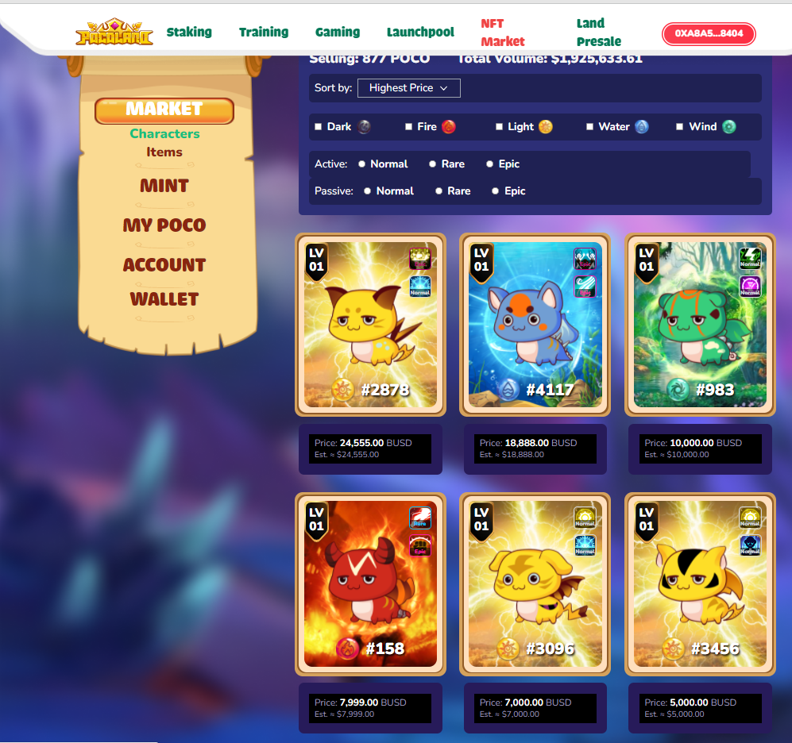

<!--   &nbsp;&nbsp; -->
<!--   &nbsp;&nbsp; -->
<!--   &nbsp;&nbsp; -->

  

  
### DeFi Experiences
- NFT Mint Dapps
<table>
    <thead align="center">
        <tr>
            <td>Cosmic Paws</td>
            <td>CryptoPigs</td>           
            <td>FunkiFoxes</td>
        </tr>
    </thead>
    <tr>
        <td>
            
        </td>
        <td>
            
        </td>           
        <td>
            
        </td>             
    </tr>
</table>

- NFT Marketplaces
<table>
    <thead align="center">
        <tr>
            <td>Pocoland</td>
            <td>Bayc</td>
            <td>Ghost</td>
        </tr>
    </thead>
    <tr>
        <td>
            
        </td>        
        <td>
            
        </td> 
        <td>
            
        </td> 
    </tr>
</table>

- Staking
<table>
    <thead align="center">
        <tr>
            <td>Pocoland</td>
            <td>Nafter</td>
            <td>IDOL</td>  
        </tr>
    </thead>
    <tr>
        <td>
            
        </td>          
        <td>
            
        </td>   
        <td>
            
        </td> 
    </tr>  
</table>
  
## My Skills

<table>
  <tr>
    <td></td>
      <td></td>
      <td></td>
      <td></td>
      <td></td>
      <td></td>
      <td></td>
      <td></td>
      <td></td>
      <td></td>
      <td></td>
      <td></td>
    </tr>
</table>

<h1 align="center"></h1>

## 𝐖𝐡𝐚𝐭 𝐈 𝐂𝐚𝐧 𝐃𝐨

  

  ### DApps & Online Betting Website
   

  ### Crypto Trading Platforms & Bots
   

  ### AR & VR Web and Mobile application
   

  ### Video Conference Web & Mobile application
   

## Github Stats  
<table><tr><td valign="top" width="50%">

</td><td valign="top" width="50%">

</td></tr></table>  

   

  

   

  
  
